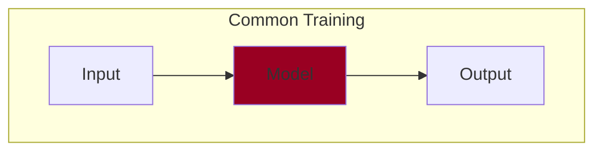
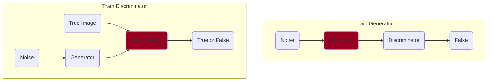
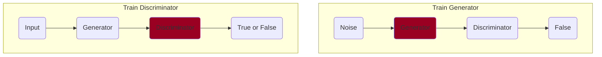
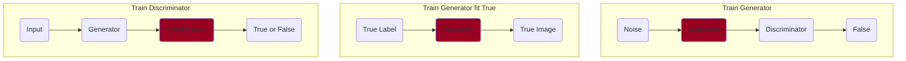

# executor.training
This is WIP. The design is likely to change.

## train()
Used for training a single deep learning model. Here red represents what the model learns. Also, it doesn't matter if the model is multitasking.

## Trainer
This may be deprecated. Used for training a single deep learning model. Here red represents what the model learns. Also, it doesn't matter if the model is multitasking.

## SerialTrainer

### DCGAN
If the model is complicated like GAN, it is difficult to handle it with train() or Trainer. For complex learning, I defined the flow in advance and let it learn. 

There are two inputs for training the discriminator, which can be expressed by combining CustomPipe and LabelPipe and using MixedPipe as follows. After that, by repeatedly learning these two in order, it is possible to learn each model in competition. The origin of "SerialTrainer" is to arrange and repeat the learning flow in a "serial", no matter how many models are intricately intertwined.

### Pseudo Conditional GAN
If you want to fix the generated image for a certain noise (like CGAN), just adding a learning flow is enough. After that, let's tune how fast you learn these learning. Please use the sample for details.However, care should be taken that the True Label is given as noise and the Discriminator is not learned.

